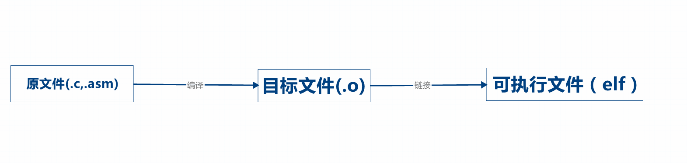
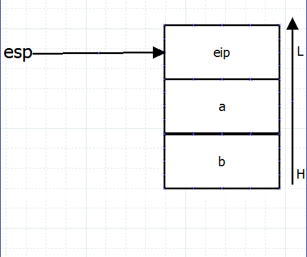

OK,今天我们就开始进入内核的初步开发了，想想还有点小激动呢。

##内容概述
---
- ELF
- C语言与汇编混合使用
	- 方法1:设置链接标志（label）
	- 方法2:直接内嵌入C代码中

- 内核初始化
	- Start
	- Link
	- Build

- iso镜像生成
	- GRUB介绍
	- iso镜像生成
	- 运行内核

##知识点分析
---

####ELF（Executable and Linkable Format）

内核，其实简单的说就是一个二进制可执行文件。那么一个二进制可执行文件的生成，经历3个过程。 

***文件后缀名只是为了标示文件格式，便于人识别，对于机器无影响。汇编文件后缀也常用`.s`或`.S`标示***
 
- **源代码编写** 用文本编辑器编写C代码或者汇编代码的过程
- **编译** 将源代码经过编译器生成目标代码或者叫做目标文件的过程
- **链接** 将目标文件链接成可执行文件的过程

二进制的可执行文件也具有一定的格式，包含可执行的二进制机器指令部分，还有一些头部，作为描述信息。  
比如，程序的**加载地址**，程序的**执行入口地址**。加载该文件的程序根据这些描述信息将程序加载到指定的位置，并从程序的入口开始执行。

ELF作为二进制可执行文件格式中的一种，是Linux的主要可执行文件格式。像Windows平台的二进制可执行文件格式叫做PE。

####C语言与汇编混合使用

一些需要**准确操作寄存器**或**端口**的代码，是无法直接用C语言来写的。所以一些初始化硬件的操作需要汇编来辅助，通常的情况是C语言与汇编混合使用。  
C语言通过编译器也是生成汇编代码之后，再编译成目标文件，所以本质上两者是一样的。
下面介绍如何将C语言与汇编混合使用。

**下面例子仅为演示，代码不规范也不完整，仅作说明作用**  
**下面例子中的链接也使用的是gcc，之后的正式代码中链接将用单独的ld命令实现**

如下是一段汇编代码

	;C与汇编混合编程测试
	;code.asm

	global mytest ;导出链接标记被外部调用
	
	extern myprint ;导入外部函数
	mytest:
	        push dword 20 ; 将20作为4字节压栈
	        push dword 10
	        call myprint ;调用外部的myprint函数
	        add esp,8 ;清理栈
	        ret; 函数返回

如下是一段C代码

	;C与汇编混合编程测试
	;main.c

	#include <stdio.h>
	
	void mytest();
	
	void myprint(int a,int b)
	{
	
	        printf("a=%d,b=%d\n",a,b);
	}
	
	int main()
	{
	        mytest(); //调用汇编中的mytest函数
	        return 0;
	}

使用如下代码生成可执行文件

	
	nasm -f elf code.asm ;编译生成code.o目标文件
	gcc -o main.o -c main.c 
	gcc -o a.out main.o code.o ;gcc的链接接口，生成a.out二进制可执行文件

运行

	./a.out

执行结果

	a=10,b=20

先解释一下汇编代码。  
第7行`mytest`标记之后到`ret`之间的代码是一个子程序。而`mytest：`是一个链接标记（label），本质是一个地址，也是一个子程序的名字，在C语言中也叫**函数**。在链接器链接时，通过函数名找到对应的链接标记。而第4行的`global`关键字的目的是将mytest这个标记导出，以便在C语言中调用。`extern`关键字目的是说明myprint这个函数是从外部引进的，以便在第10行调用。

再看C语言代码。  
main函数中调用了`mytest`函数，该函数的过程是在汇编文件中实现。也就是`mytest`标记之后的语句，直到`ret`语句返回为止。而更具C语言函数的规则，使用前必须声明。所以在main函数之前声明了`void mytest()`。main函数之前还定义了一个`myprint`函数，该函数在汇编中被调用`call myprint`。如前面所说汇编文件中在调用之前用`extern`进行声明该函数来自外部（来自别的汇编文件也可以）。

所以综上，在汇编中的程序如果需要**被外部调用**，就需要用`global`关键字，将标记导出。汇编中需要**调用外部函数**则在调用之前就要用`extern`声明该函数的名字。

那么，在函数调用的过程中的参数传递和返回值是如何解决的？通过遵循**C调用约定**（C Calling convention）来解决  

- 函数中后面的参数先入栈
- 函数的返回值通过**EAX**寄存器传递
- 由调用者清理栈

所以上述汇编例子中，push了两个4字节（dword）的整数20和10。而在C语言中接收到的顺序是相反的，a=10,b=20。这也验证了函数中后面的参数先入栈的原则。  
同样的，当在C语言中调用汇编中定义的函数时，如调用下面的函数  

	func(a,b);（a,b为4字节类型）

先将b压入栈，再将a压入栈，最后压入eip**（下一条程序地址，便于返回时从栈中取出返回至原程序）**  
则在汇编函数中，[esp+4]存储的是a,[esp+8]存储的是b。栈图如下

可通过
	
	mov eax [esp+4]
	mov ebx [esp+8]

将a放入eax中，将b放入ebx中

返回值的处理则较为简单，只需在eax放入返回值，然后调用汇编的`ret`指令,就可在C语言中收到返回值。这里就不过多叙述。

以上是C和汇编互相调用的一种方法。另一种在**C中调用汇编**的方法将在以后运用到的地方再说。

##注意提醒
---

- C与汇编混合使用中有**[由调用者清理栈]**原则，所以当在汇编代码中调用C的函数时，记得将压入栈中的参数退栈。其实只要将esp指针重新指到压栈前的位置即可。上述例子中`add esp,8`即将栈指针重新向下移动8个字节（2个int大小)。C调用汇编中的函数就不需要，C编译器已经帮你做了这个工作
- X86平台堆栈是由高地址向低地址衍生